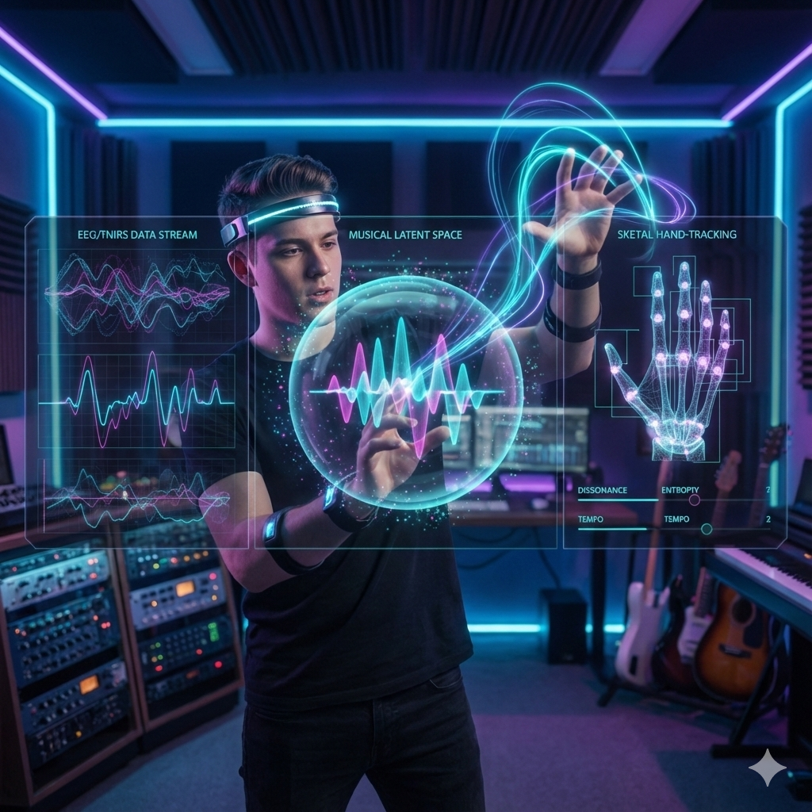
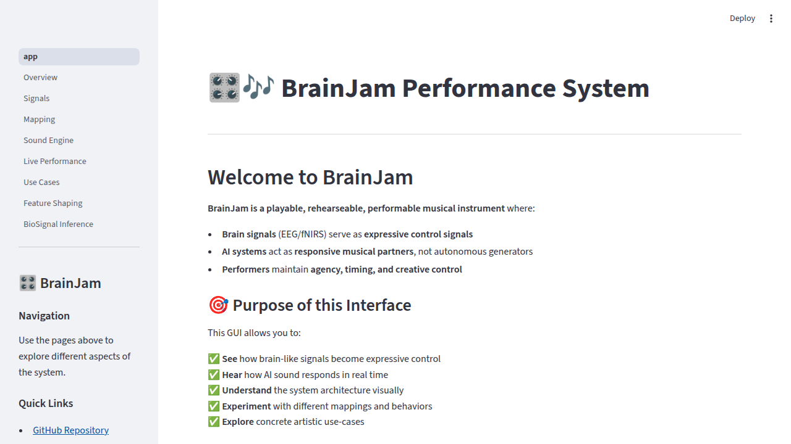
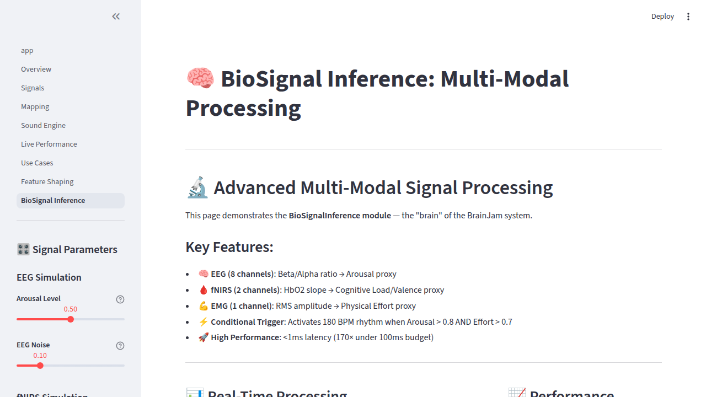
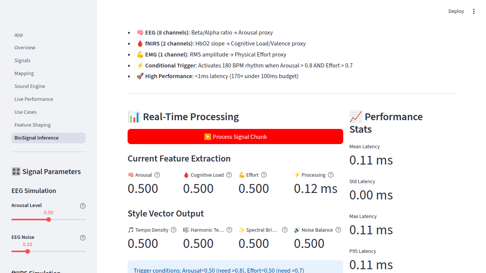

# BrainJam: AI-Mediated Musical Performance System

A performance instrument and AI co-performer exploring human–AI interaction in live music.
Developed as part of MishMash WP1: AI for Artistic Performances.

[]()
[]()
[]()



---

## 🎬 See It In Action

<video src="https://github.com/curiousbrutus/brainjam/raw/main/media/vid_bj.mp4" controls width="100%" autoplay muted loop>
  Your browser does not support the video tag.
</video>

*Live prototype demonstration of BrainJam's brain-to-sound performance system*

---

## What BrainJam Is

**BrainJam is a playable, rehearseable, performable musical instrument** where:

- **Brain signals** (EEG/fNIRS) serve as **optional expressive control signals**
- **AI systems** act as **responsive musical partners**, not autonomous generators
- **Performers** maintain **agency, timing, and creative control**
- The system is designed for **live performance** with real-time constraints (<100ms latency)

### Core Framing

- **Brain signals are control inputs** — comparable to gesture, breath, or touch
- **NOT brain reading or decoding** — we do not interpret semantic content
- **AI is a co-performer** — responding to and engaging with the performer
- **Psychology evaluates the system** — measuring agency, flow, and responsiveness

### Key Goals

1. Create a **responsive, low-latency** musical performance system
2. Explore **performer–AI feedback loops** in real time
3. Maintain **performer agency** and creative control
4. Make the system **meaningful for musicians and audiences**

---

## 🎛️ Interactive GUI (NEW!)

**Try the Streamlit GUI** to explore BrainJam visually and interactively:

```bash
# Install dependencies
pip install -r requirements.txt

# Run the GUI
streamlit run streamlit_app/app.py
# Or use the helper script
./run_gui.sh
```

The GUI provides:
- 📖 **Overview** — Understand system architecture and philosophy
- 📊 **Signals** — Explore mock EEG/fNIRS signal generation
- 🔀 **Mapping** — Experiment with control design strategies
- 🔊 **Sound Engine** — Hear how controls affect synthesis
- 🎭 **Live Performance** — Try the complete system MVP
- 🎨 **Use Cases** — Connect to research applications

**Perfect for**:
- Understanding the system in 5 minutes
- Interactive exploration and experimentation
- Demonstrating to supervisors, collaborators, or audiences
- Teaching human-AI interaction concepts

### GUI Preview

<table>
  <tr>
    <td></td>
    <td></td>
    <td></td>
  </tr>
</table>

See [`streamlit_app/README.md`](streamlit_app/README.md) for details.

---

## 📸 Learn More: Videos & Resources

### 🎓 Deep Dive: System Philosophy

<video src="https://github.com/curiousbrutus/brainjam/raw/main/media/BrainJam__Nervous_System_Music.mp4" controls width="100%">
  Your browser does not support the video tag.
</video>

*Understanding the conceptual foundation: why nervous system signals, how AI mediates performance, and what makes this different from brain decoding*

---

**All media resources** (videos, screenshots, diagrams) are available in the [`media/`](media/) folder for presentations, publications, and demonstrations.

---

## What BrainJam Is NOT

🚫 **NOT brain decoding** — We do not decode thoughts, intentions, or mental content

🚫 **NOT mind reading** — Brain signals are noisy, continuous control parameters

🚫 **NOT focused on signal accuracy** — Optimization is for musical expression, not classification

🚫 **NOT clinical or therapeutic** — This is a performance instrument, not a medical device

🚫 **NOT neuroscience research** — Psychology supports evaluation, not the primary focus

---

## System Architecture

### 🗺️ Visual Overview


*Complete system mindmap showing connections between components, research context, and design philosophy*

### Technical Flow

```
┌─────────────────────────────────────────────────────────────┐
│                    BRAINJAM PERFORMANCE SYSTEM               │
└─────────────────────────────────────────────────────────────┘

┌──────────────────┐
│   CONTROLLERS    │  ← Input Layer: Various control signals
├──────────────────┤
│ • Mock EEG       │     Structured test signals
│ • Keyboard       │     Manual control for testing/comparison
│ • Real EEG/fNIRS │     Optional biophysical input
│ • MIDI/OSC       │     Standard music interfaces
└──────────────────┘
        ↓
┌──────────────────┐
│ MAPPING MODELS   │  ← Mapping Layer: Control → Parameters
├──────────────────┤
│ • Linear         │     Simple affine transform
│ • MLP            │     Nonlinear mapping
│ • Smoothing      │     Temporal stability
└──────────────────┘
        ↓
┌──────────────────┐
│  SOUND ENGINES   │  ← Synthesis Layer: Generate audio
├──────────────────┤
│ • Parametric     │     Real-time synthesis
│ • DDSP-style     │     Differentiable DSP
│ • Diffusion      │     Generative models (offline)
└──────────────────┘
        ↓
┌──────────────────┐
│   AUDIO OUTPUT   │  ← Output: To performer and audience
└──────────────────┘
        ↓
┌──────────────────┐
│ PERFORMER        │  ← Feedback loop closes here
└──────────────────┘
```

### Latency Budget

Target: **< 100ms** end-to-end

- Signal acquisition: 10-40ms
- Feature extraction: 10-30ms
- Mapping: <5ms
- Sound synthesis: 20-50ms
- **Total**: ~50-120ms

---

## Live Performance MVP

### Quick Start

**Option 1: Interactive GUI (Recommended for First-Time Users)**

```bash
# Install dependencies
pip install -r requirements.txt

# Run the Streamlit GUI
streamlit run streamlit_app/app.py
```

Open your browser to explore the system interactively!

**Option 2: Jupyter Notebooks**

```bash
# Install dependencies
pip install -r requirements.txt

# Run the real-time demo
jupyter notebook notebooks/real_time_control_to_sound.ipynb
```

### Current Implementation

A working real-time system with:

1. **Mock EEG controller** — Generates realistic control signals for development
2. **Parametric synthesizer** — Controllable parameters:
   - `tempo_density` — Event rate (0=sparse, 1=dense)
   - `harmonic_tension` — Consonance/dissonance
   - `spectral_brightness` — Timbral quality
   - `noise_balance` — Textural character
3. **Real-time loop** — Input → Mapping → Synthesis → Audio (<100ms)

### Quick Start

```bash
# Install dependencies
pip install -r requirements.txt

# Run the real-time demo
jupyter notebook notebooks/real_time_control_to_sound.ipynb
```

### Demo Notebooks

1. **`real_time_control_to_sound.ipynb`**
   - Keyboard or mock EEG controls sound in real time
   - Visualize control parameters
   - Hear audio feedback immediately

2. **`ai_co_performer_demo.ipynb`**
   - Performer input influences AI timing and density
   - AI responds musically (call-and-response patterns)
   - Demonstrates performer–system interaction

---

## Relation to MishMash WP1

**MishMash WP1**: "AI for Artistic Performances"  
🔗 https://mishmash.no/wp1/  
🔗 https://www.jobbnorge.no/en/available-jobs/job/291081/doctoral-research-fellow-phd-in-creative-human-ai-interaction

### Alignment with WP1 Goals

| WP1 Theme | BrainJam Implementation |
|-----------|------------------------|
| **AI for artistic performance** | AI as responsive co-performer, not autonomous system |
| **Human–AI interaction** | Real-time feedback loops, performer agency |
| **Creative technology** | Expressive control through embodied signals |
| **Performance systems** | Playable, rehearseable, performable live |
| **Evaluation** | Agency, flow, responsiveness metrics |

### Research Questions

1. **Agency**: How do performers experience control in AI-mediated systems?
2. **Responsiveness**: What latency is acceptable for musical interaction?
3. **Feedback loops**: How do performer and AI mutually influence each other?
4. **Expressiveness**: Can biophysical signals provide meaningful musical control?
5. **Audience perception**: How is AI co-performance experienced by audiences?

### Methodological Approach

- **Practice-based research** — Build and perform with the system
- **User studies** — Evaluate with musicians and performers
- **Interaction measures** — Agency, flow, timing metrics
- **Live demonstrations** — Public performances and showcases

---

## Project Structure

```
brainjam/
│
├── streamlit_app/              # 🎛️ Interactive GUI (NEW!)
│   ├── app.py                  # Main entry point
│   ├── pages/                  # Multi-page application
│   │   ├── 1_Overview.py      # System introduction
│   │   ├── 2_Signals.py       # Signal simulation
│   │   ├── 3_Mapping.py       # Control design
│   │   ├── 4_Sound_Engine.py  # Sound synthesis
│   │   ├── 5_Live_Performance.py  # Complete system demo
│   │   └── 6_Use_Cases.py     # Research applications
│   ├── utils/                  # GUI utilities
│   └── README.md              # GUI documentation
│
├── media/                      # 📸 Videos, screenshots, and diagrams
│   ├── vid_bj.mp4             # Prototype demonstration video
│   ├── BrainJam__Nervous_System_Music.mp4  # System explanation video
│   ├── Mind Map.png           # Architecture mindmap
│   ├── gui_person.png         # AI-generated user interaction visual
│   └── st-gui-*.png           # Streamlit GUI screenshots
│
├── performance_system/         # Core performance system
│   ├── controllers/            # Input: EEG, keyboard, MIDI, etc.
│   ├── sound_engines/          # Synthesis and generation
│   ├── mapping_models/         # Control → parameter mapping
│   └── interaction_demos/      # Working demos and examples
│
├── interaction_measures/       # Evaluation: agency, flow, responsiveness
│   ├── questionnaires/         # Simple self-report measures
│   ├── behavioral_tasks/       # Timing and interaction metrics
│   └── validation/             # System evaluation frameworks
│
├── ethics_and_access/          # Ethics: consent, transparency, accessibility
│
├── notebooks/                  # Jupyter notebooks and demos
│   ├── real_time_control_to_sound.ipynb
│   └── ai_co_performer_demo.ipynb
│
├── models/                     # Documentation of AI models
├── literature/                 # Curated research papers
│
├── README.md                   # This file
├── ethics.md                   # Ethical considerations
└── requirements.txt            # Python dependencies
```

---

## Installation

### Prerequisites

- Python 3.8+
- (Optional) PyAudio for real-time audio
- (Optional) Jupyter for notebooks

### Setup

```bash
# Clone the repository
git clone https://github.com/curiousbrutus/brainjam.git
cd brainjam

# Create virtual environment (recommended)
python -m venv venv
source venv/bin/activate  # On Windows: venv\Scripts\activate

# Install dependencies
pip install -r requirements.txt

# (Optional) Install PyAudio for real-time audio
pip install pyaudio
```

### Verify Installation

```python
# Test the performance system
from performance_system.controllers import MockEEGController
from performance_system.sound_engines import ParametricSynth

controller = MockEEGController()
synth = ParametricSynth()

# Get control vector
controls = controller.get_control_vector()
print(f"Controls: {controls}")

# Generate audio (0.1 seconds)
audio = synth.generate(0.1, controls)
print(f"Audio shape: {audio.shape}")
```

---

## Usage

### Real-Time Performance

```python
import numpy as np
import pyaudio
from performance_system.controllers import MockEEGController
from performance_system.sound_engines import ParametricSynth

# Initialize system
controller = MockEEGController()
synth = ParametricSynth(sample_rate=44100)

# Audio setup
chunk_duration = 0.1  # 100ms chunks
p = pyaudio.PyAudio()
stream = p.open(format=pyaudio.paFloat32, channels=1, 
                rate=44100, output=True)

# Performance loop
try:
    while True:
        # Get control signal
        controls = controller.get_control_vector(duration=0.5)
        
        # Generate audio
        audio = synth.generate(chunk_duration, controls)
        
        # Output audio
        stream.write(audio.tobytes())
except KeyboardInterrupt:
    stream.close()
    p.terminate()
```

### Custom Mappings

```python
from performance_system.mapping_models import LinearMapper

# Create custom mapping
mapper = LinearMapper(n_inputs=4, n_outputs=4)

# Map controller output to synth parameters
raw_controls = controller.get_control_vector()
mapped_controls = mapper.map(raw_controls)

# Use mapped controls
audio = synth.generate(0.1, mapped_controls)
```

---

## ML/DL Pipeline

### Stage 1: Signal Input & Feature Shaping

**Purpose**: Convert raw signals to low-dimensional latent controls (2-8 dimensions)

**Input Sources**:
- Mock EEG (structured random signals for testing)
- Keyboard (manual control)
- Real EEG/fNIRS (optional)

**Feature Shaping (NEW)**:
- **PCA Reducer**: Dimensionality reduction via Principal Component Analysis
- **Autoencoder**: PyTorch-based neural compression to latent space
- **Temporal Smoother**: Sliding window smoothing with exponential/median filtering

**Output**: 2-8 latent controls representing intensity, tension, volatility, density (NOT mental states)

### Stage 2: Expressive Mapping Layer

**Purpose**: Map latent controls → synthesis parameters with artistic expression

**Mapping Models**:
- **Linear Mapper**: Simple affine transformation with temporal smoothing
- **MLP Mapper**: Small neural network (8 hidden units) for nonlinear mapping
- **Expressive Mapper** (NEW): Many-to-one mappings with hysteresis, drift, and thresholds

**Expressive Features**:
- Many-to-one mappings (multiple inputs → each output)
- Hysteresis (history-dependent response)
- Autonomous parameter drift
- Threshold-based regions (vs continuous precision)
- Inertia (resistance to rapid change)

**Philosophy**: Following Miranda (2014), expressivity emerges from interaction, not precision

### Stage 3: Sound Engines

**Purpose**: Generate audio from control parameters

**Available Engines**:
- **Parametric Synth**: Additive/subtractive synthesis with real-time control
- **DDSP Synth** (NEW): Harmonic oscillator + filtered noise (DDSP-style)
- **Symbolic Synth** (NEW): Note-based synthesis with MIDI-like events

**Controllable Parameters**:
- Pitch range / note density
- Harmonic complexity / brightness
- Spectral brightness / roughness
- Noise balance / amplitude

### Stage 4: Real-Time Performance Loop

```
Brain Signal (10-40ms) → 
Feature Shaping (10-30ms) → 
Expressive Mapping (<5ms) → 
Sound Synthesis (20-50ms) → 
Audio Output → 
Performer Feedback
```

**Target Latency**: < 100ms end-to-end ✓

### Stage 5: Interaction Logging

**Performance Logger** tracks:
- Latency measurements (mean, std, p95)
- Stability metrics (parameter variance)
- Controllability assessment (input-output correlation)
- Performer-rated agency (subjective 0-10 scale)
- Perceived responsiveness

---

## MVP Demonstrations

### Demo 1: Brain → Continuous Sound

**Concept**: Pure textural ambient soundscape with no discrete rhythm

**Features**:
- EEG-like signals control timbre and density
- No notes or rhythm - just evolving texture
- Temporal smoothing for stable sound
- 30-second demonstration

**Run**: `python performance_system/interaction_demos/demo1_continuous_sound.py`

### Demo 2: AI as Co-Performer

**Concept**: Musical dialogue between performer and AI system

**Features**:
- Performer triggers events via brain signals
- AI responds with timing variations
- Brain signal biases AI behavior (doesn't command it)
- Call-and-response patterns emerge
- 40-second demonstration

**Run**: `python performance_system/interaction_demos/demo2_ai_coperformer.py`

### Demo 3: Learning Through Practice

**Concept**: Performer improves control through repeated practice

**Features**:
- Same mapping throughout session
- Simulated learning (increasing focus)
- Stability visualization over time
- Learning curve shows controllability improvement
- 60-second demonstration with visualization

**Run**: `python performance_system/interaction_demos/demo3_learning_practice.py`

### Run All Demos

**Run all three demos in sequence**:
```bash
python performance_system/interaction_demos/run_all_demos.py
```

---

## Evaluation: Interaction Measures

Evaluation focuses on **performer experience** and **system responsiveness**:

### Primary Measures

1. **Agency**
   - "I felt in control of the sounds" (1-10)
   - "The system responded to my intentions" (1-10)

2. **Responsiveness**
   - Measured latency (ms)
   - Perceived predictability (1-10)

3. **Flow**
   - "I was fully engaged" (1-10)
   - "Time passed quickly" (1-10)

4. **Timing Variability**
   - System response consistency
   - Control parameter stability

### NOT Clinical Assessment

- ✗ No diagnostic claims
- ✗ No therapeutic goals
- ✗ No mental state decoding

See: [`interaction_measures/README.md`](interaction_measures/README.md)

---

## Ethics: Performer-Centered

Ethics centers on **performer consent, transparency, and accessibility**:

### Core Principles

1. **Performer Consent**
   - Clear explanation of system behavior
   - Transparent data use
   - Right to withdraw

2. **System Transparency**
   - Performers understand control mappings
   - No hidden automation
   - Explainable AI behavior

3. **Unpredictability in Performance**
   - Some randomness is performative, not a bug
   - Performers can embrace or constrain variability

4. **Accessibility**
   - Design for neurodivergent performers
   - Consider disabled musicians
   - Avoid normative assumptions about "correct" signals

### NOT Clinical Ethics

- ✗ Not medical device regulations
- ✗ Not therapeutic intervention ethics
- ✗ Not diagnostic testing guidelines

See: [`ethics.md`](ethics.md)

---

## Real-Time Devices & Future Integration

BrainJam is designed with **modularity** and **performance awareness** as core principles. While currently operating with mock signals, the system architecture supports integration with real-time devices.

### Signal Source Abstraction

All signal sources implement a unified `BaseDevice` interface:

```python
from performance_system.signals.realtime import BaseDevice

# All devices expose the same method
control_frame = device.get_control_frame()
# Returns: {'intensity': 0.7, 'density': 0.4, 'variation': 0.6, ...}
```

### Supported Device Types

#### 🧠 Real-Time EEG via Lab Streaming Layer (LSL)

**Status**: ⚠️ Experimental / Scaffolded

Integration for consumer and research-grade EEG systems:
- **Hardware**: Muse, OpenBCI, Emotiv, medical EEG systems
- **Protocol**: Lab Streaming Layer (LSL) — standard for biosignal streaming
- **Features**: Band-power extraction, real-time processing
- **Latency**: Target <50ms from signal to feature

**Implementation**: See `performance_system/signals/realtime/eeg_lsl_stub.py`

**Requirements**: `pip install pylsl`, EEG hardware setup

**Literature**: Miranda & Castet (2014). *Guide to Brain-Computer Music Interfacing*

#### 🎹 MIDI Controllers

**Status**: ⚠️ Experimental / Scaffolded

Standard MIDI integration for musical control:
- **Hardware**: Keyboards, pads, breath controllers, expression pedals
- **Protocol**: MIDI CC (Continuous Controller) messages
- **Use Case**: Combine brain signals with traditional control, or use as baseline for comparison
- **Latency**: ~10ms

**Implementation**: See `performance_system/signals/realtime/midi_stub.py`

**Requirements**: `pip install mido python-rtmidi`, MIDI controller

#### 📡 OSC (Open Sound Control)

**Status**: ⚠️ Experimental / Scaffolded

Network-based control for flexible device integration:
- **Hardware**: TouchOSC apps, Max/MSP, custom controllers
- **Protocol**: OSC over UDP/TCP
- **Use Case**: Wireless control, multi-device setups, custom interfaces
- **Latency**: ~20ms (network dependent)

**Implementation**: See `performance_system/signals/realtime/osc_stub.py`

**Requirements**: `pip install python-osc`, network configuration

### Generative Sound Engines

BrainJam's architecture supports integration with generative AI music models:

#### 🎵 Suno-Like Systems

**Key Principle**: Brain signals **modulate** generation parameters; they do NOT generate music directly.

**Control Flow**:
```
Brain Signals → Control Parameters → Modulate Generation → Audio Output
```

**Implementation**: See `performance_system/sound_engines/generative/`

**Available Adapters**:
- `RealtimeSynthAdapter` — Wraps existing synthesis engines
- `MusicGenAdapter` — Meta AudioCraft integration (stub)
- `SunoLikeAdapter` — Simulates generative control locally (no API required)

**Status**: Conceptual/simulated. Demonstrates interface without requiring paid APIs or heavy compute.

### Design Philosophy

**Visibility > Completeness**
- Real-time devices are acknowledged and scaffolded
- Interface defined even if implementation pending
- Mock data used to demonstrate functionality

**Playability > Decoding**
- Focus on continuous, expressive control
- Prioritize low latency and responsiveness
- Maintain performer agency

**Honesty > Ambition**
- Clearly label experimental components
- No false promises about functionality
- Transparent about current limitations

### Integration Roadmap

**Current** (Mock Signals):
- ✅ Structured test signals
- ✅ Consistent interface
- ✅ Full system functionality

**Near-Term** (Real-Time Devices):
- 🔜 LSL EEG integration
- 🔜 MIDI controller support
- 🔜 OSC network control

**Long-Term** (Advanced Features):
- 🔮 Pretrained EEG encoders (EEGNet, braindecode)
- 🔮 Generative AI integration (MusicGen, diffusion models)
- 🔮 Multi-modal fusion (EEG + gesture + MIDI)

### Literature & Context

**Brain-Computer Music Interfacing**:
- Miranda, E. R., & Castet, J. (Eds.). (2014). *Guide to Brain-Computer Music Interfacing*. Springer.
- Grierson, M. (2008). "Composing with brainwaves: Minimal trial P300b recognition as an indication of subjective preference."

**Generative Music Systems**:
- Agostinelli et al. (2023). "MusicGen: Simple and controllable music generation."
- Dhariwal et al. (2020). "Jukebox: A generative model for music."

**Performance Systems**:
- Tanaka, A. (2006). "Interaction, experience and the future of music."
- Cook, P. R. (2001). "Principles for designing computer music controllers."

**Note**: BrainJam emphasizes **performance-ready modularity** while maintaining **research transparency**. Real-time devices are designed as plug-and-play modules that don't compromise the system's core functionality when unavailable.

---

## Development Roadmap

### Phase 1: Foundation ✅ COMPLETE
- [x] Mock controller system
- [x] Real-time synthesizers (Parametric, DDSP, Symbolic)
- [x] Mapping models (Linear, MLP, Expressive)
- [x] Feature shaping (PCA, Autoencoder, Temporal)
- [x] Working demos (3 MVP demonstrations)
- [x] Performance logging and metrics
- [x] Streamlit GUI

### Phase 2: Extended Capabilities
- [ ] Real EEG/fNIRS integration
- [ ] Advanced AI co-performer behaviors
- [ ] Multi-agent interaction patterns
- [ ] Additional sound engines (granular, FM)
- [ ] Preset management system

### Phase 3: User Studies
- [ ] Pilot with 5-10 musicians
- [ ] Agency and flow evaluation
- [ ] Iterate on mappings based on feedback
- [ ] Public demonstrations and performances
- [ ] Document case studies

### Phase 4: Research Publications
- [ ] Human-AI interaction papers
- [ ] Performance system documentation
- [ ] Artistic case studies
- [ ] Technical implementation reports

---

## Contributing

BrainJam is research software for a PhD project. Contributions are welcome:

### How to Contribute

1. **Report issues** — Bug reports, feature requests
2. **Improve documentation** — Clarify usage, add examples
3. **Add controllers** — New input modalities
4. **Design mappings** — Creative control strategies
5. **Create sounds** — New synthesis engines

### Development Principles

- **Keep latency low** — Target <100ms end-to-end
- **Maintain performer agency** — Human remains in control
- **Make it performable** — Real-time, stable, rehearseable
- **Be transparent** — Clear system behavior
- **Stay critical** — Avoid hype, embrace limitations

---

## Citation

If you use BrainJam in your research:

```bibtex
@software{brainjam2025,
  title={BrainJam: AI-Mediated Musical Performance System},
  author={Eyyub Guven},
  year={2025},
  url={https://github.com/curiousbrutus/brainjam},
  note={PhD research project for MishMash WP1}
}
```

---

## License

This project is open source for academic and educational purposes.  
See [LICENSE](LICENSE) for details.

---

## Contact

**Researcher**: Eyyub Guven  
**Email**: eyyub.gvn@gmail.com  

For questions, collaborations, or performance inquiries, please open an issue or contact directly.

---

**Remember**: BrainJam is a **performance instrument**, not a neuroscience experiment.  
Brain signals are **expressive controls**, not decoded thoughts.  
AI is a **musical partner**, not an autonomous system.
